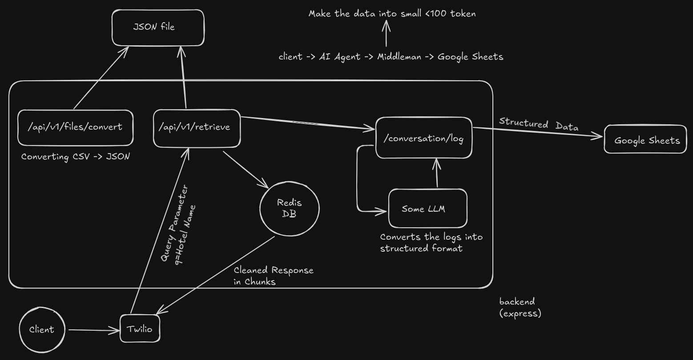

## Overview

This project implements a Voice AI agent using Retell AI, integrated with Express.js APIs, Google Sheets for conversation logging, and Redis for caching.

## Example Architecture



## Features

- **CSV Processing**: Automated conversion of hotel data from CSV to structured JSON
- **Data Chunking**: Smart splitting of large data objects for optimal processing
- **Redis Caching**: Fast data retrieval with Redis implementation
- **Google Sheets Integration**: Real-time logging of conversation data
- **TypeScript & Express**: Type-safe API development with modular structure

## Tech Stack

- Node.js + Express.js
- TypeScript
- Redis
- Google Sheets API
- CSV Parser

## API Endpoints

- **GET `/api/v1/files/convert`**: Convert CSV files to JSON
- **GET `/api/v1/retrieve?q=RoomName`**: Get chunkified room data
- **POST `/api/v1/conversation/logs`**: Log conversation data to Google Sheets

## Prerequisites

- Node.js (v14 or higher)
- Redis server
- Google Cloud Platform account with Sheets API enabled

## Setup Instructions

1. Clone the repository:
```bash
git clone https://github.com/GeekyProgrammer07/formi-bot.git
cd formi-bot
```

2. Install dependencies:
```bash
npm install
```

3. Configure environment variables:
Create a `.env` file in the root directory:
```bash
SHEET_ID=your_google_sheet_id
```

4. Set up Google Sheets credentials:
- Place your `credentials.json` in `src/assets/data/`
- Configure the Google Sheet with appropriate headers

5. Start Redis server:
```bash
docker start redis-cache
```

6. Start the development server:
```bash
npm run dev
```

## Redis Setup with Docker

1. Pull the Redis Docker image:
```bash
docker pull redis
```

2. Run Redis container:
```bash
docker run --name redis-cache -p 6379:6379 -d redis
```

3. Verify Redis container is running:
```bash
docker ps
```

4. Access Redis CLI (if needed):
```bash
docker exec -it redis-cache redis-cli
```

5. Stop Redis container:
```bash
docker stop redis-cache
```

## Project Structure

```
src/
  ├── assets/
  │   ├── data/
  │   │   ├── credentials.json
  │   │   └── finalData.json
  │   └── files/
  │       ├── hotel-rules.csv
  │       ├── price.csv
  │       ├── rooom-information.csv
  │       └── staff-queries.csv
  ├── config/
  │   └── redis.ts
  ├── controller/
  │   ├── conversationLogs.ts
  │   ├── fileController.ts
  │   └── retrieveController.ts
  ├── routes/
  │   ├── conversationRouter.ts
  │   ├── fileRouter.ts
  │   ├── mainRouter.ts
  │   └── queryRouter.ts
  ├── types/
  │   ├── HotelRules.ts
  │   ├── Price.ts
  │   ├── RoomInfo.ts
  │   └── Staff.ts
  ├── utilities/
  │   ├── cacheChunks.ts
  │   ├── chunkify.ts
  │   └── estimatedTokenCount.ts
  └── index.ts
```